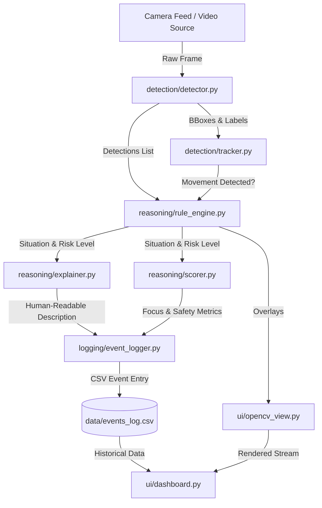

# 🎥 AI Situational Understanding Camera

[](https://www.python.org/)
[](https://opensource.org/licenses/MIT)
[](https://streamlit.io/)
[](https://github.com/ultralytics/ultralytics)

An intelligent real-time camera processing pipeline that performs object detection, movement tracking, and situational reasoning. By combining spatial awareness with custom rule-based heuristics, this system calculates real-time focus & safety scores, displays graphical overlays, logs events, and hosts an interactive Streamlit dashboard.

---

## 🏗️ System Architecture & Workflow



---

## 📂 Project Structure

```text
situational-camera/
├── main.py               # Main pipeline runner showing execution & call order
├── detection/            # Perception Layer
│   ├── __init__.py
│   ├── detector.py       # YOLOv8 object detector wrapper
│   └── tracker.py        # Movement tracker & bounding box center tracking
├── reasoning/            # Intelligence Layer
│   ├── __init__.py
│   ├── rule_engine.py    # Multi-variable situation classification rules
│   ├── explainer.py      # Natural language explanation generator
│   └── scorer.py         # Real-time safety (0-10) and focus (0-100) scoring
├── logging/              # Storage Layer
│   ├── __init__.py
│   └── event_logger.py   # State change event logger (saves to CSV)
├── ui/                   # Interface Layer
│   ├── __init__.py
│   ├── opencv_view.py    # OpenCV HUD overlays (bounding boxes & telemetry)
│   └── dashboard.py      # Live Streamlit dashboard app
├── data/                 # Data Assets
│   └── .gitkeep          # Stores events_log.csv
├── requirements.txt      # Project dependencies
└── README.md             # Subfolder documentation
```

---

## 🤝 Shared Data Contracts

Every module has been scaffolded to strict design contracts:

### 1. Object Detection Contract
**Module**: `detector.py` | **Function**: `detect_objects(frame)`
* **Input**: OpenCV image frame (`numpy.ndarray`)
* **Output**: `list` of dictionaries:
  ```python
  [
      {
          "label": "person", 
          "bbox": [x1, y1, x2, y2], 
          "confidence": 0.92
      },
      ...
  ]
  ```

### 2. Movement Tracking Contract
**Module**: `tracker.py` | **Function**: `is_moving(person_id, current_bbox) -> bool`
* **Input**: Unique person ID (`int`/`str`), current bounding box coordinates `[x1, y1, x2, y2]`.
* **Output**: `bool` indicating if movement exceeds spatial thresholds.

### 3. Rule Reasoning Contract
**Module**: `rule_engine.py` | **Function**: `evaluate_situation(detections, movement_detected) -> dict`
* **Input**: List of current frame object detections, movement tracking boolean.
* **Output**: Evaluation outcome:
  ```python
  {
      "situation": "Walking while texting",
      "risk": "High"
  }
  ```

### 4. Natural Explanation Contract
**Module**: `explainer.py` | **Function**: `generate_explanation(situation: str) -> str`
* **Output**: Human-readable situation context (e.g., `"The individual is walking while distracted by a mobile device."`).

### 5. Metric Scoring Contract
**Module**: `scorer.py` | **Function**: `compute_scores(situation: str, risk: str) -> dict`
* **Output**: Score levels:
  ```python
  {
      "focus_score": 15,    # 0 to 100 range
      "safety_score": 2     # 0 to 10 range
  }
  ```

### 6. Event Logging Contract
**Module**: `event_logger.py` | **Function**: `log_event(event: dict)`
* Appends event data schemas to `data/events_log.csv`.

---

## ⚡ Quick Start

### ⚙️ Prerequisites
Ensure you have **Python 3.8+** installed.

### 1. Installation & Environment Setup
Clone the repository and set up a virtual environment:
```bash
# Clone the repository
git clone https://github.com/Chathuka-Pehesara/AI-Situational-Understanding-Camera.git
cd AI-Situational-Understanding-Camera/situational-camera

# Create a virtual environment
python -m venv venv

# Activate it (Windows)
.\venv\Scripts\activate

# Install dependencies
pip install -r requirements.txt
```

### 2. Running the Streamlit Dashboard
Launch the web interface dashboard:
```bash
streamlit run ui/dashboard.py
```

### 3. Pipeline Dry Run
Execute the pipeline demonstration sequence:
```bash
python main.py
```

---

## 📜 License
Distributed under the MIT License. See [LICENSE](LICENSE) for details.
