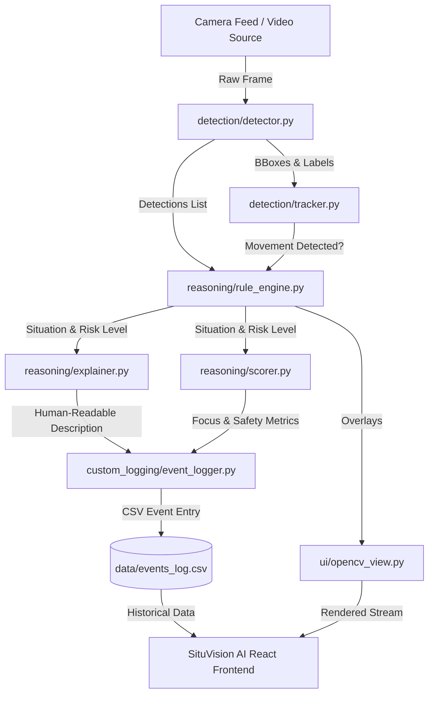

# 🎥 AI Situational Understanding Camera (SituVision AI)

<div align="center">
  <p><strong>An intelligent real-time camera processing pipeline for object detection, movement tracking, and situational reasoning.</strong></p>

  [](https://www.python.org/)
  [](https://fastapi.tiangolo.com/)
  [](https://reactjs.org/)
  [](https://github.com/ultralytics/ultralytics)
  [](https://opensource.org/licenses/MIT)
</div>

<br />

By combining spatial awareness with custom rule-based heuristics and Generative AI, this system calculates real-time focus & safety scores, displays graphical overlays, logs events, and hosts an interactive modern dashboard for situational monitoring.

---

## ✨ Key Features

- 🎯 **Real-Time Object Detection**: Powered by YOLOv8 for accurate and fast inference, automatically adjusting to low-light conditions with CLAHE enhancement.
- 🚶 **Intelligent Tracking**: Tracks multi-person movement and monitors specific spatial zones (loitering, trespassing).
- 🧠 **Rule-Based Reasoning & AI Verification**: Classifies situations using local heuristics, with an optional cognitive layer using Google Gemini 1.5 Flash for complex scene verification.
- 💬 **Natural Language Explanations**: Translates telemetry and visual data into human-readable descriptions of identified situations and risks.
- 📊 **Dynamic Scoring System**: Computes real-time Safety (0-10) and Focus (0-100) scores based on identified behaviors and environmental factors.
- 🌐 **Modern SituVision Dashboard**: A beautiful, responsive React/Vite web application for live monitoring, alerts, and historical data visualization.
- 📝 **Comprehensive Data Logging**: Structured event logging into CSV format for auditing and historical analysis.

---

## 🏗️ System Architecture & Workflow


```mermaid
graph TD
    A[Camera Feed / Video Source] -->|Raw Frame| B[detection/detector.py]
    B -->|BBoxes & Labels| C[detection/tracker.py]
    B -->|Detections List| D[reasoning/rule_engine.py]
    C -->|Movement Detected?| D
    D -->|Situation & Risk Level| E[reasoning/explainer.py]
    D -->|Situation & Risk Level| F[reasoning/scorer.py]
    E -->|Human-Readable Description| G[custom_logging/event_logger.py]
    F -->|Focus & Safety Metrics| G
    D -->|Overlays| H[ui/opencv_view.py]
    G -->|CSV Event Entry| I[(data/events_log.csv)]
    I -->|Historical Data| J[SituVision AI React Frontend]
    H -->|Rendered Stream| J
```

---

## ⚡ Quick Start

### ⚙️ Prerequisites
- **Python 3.8+**
- **Node.js 16+** & **npm**
- A valid Google Gemini API key (optional but recommended for advanced reasoning).

### 🛠️ 1. Installation & Environment Setup

Clone the repository and set up your virtual environment:

```bash
# Clone the repository
git clone https://github.com/Chathuka-Pehesara/AI-Situational-Understanding-Camera.git
cd AI-Situational-Understanding-Camera/situational-camera

# Create and activate a virtual environment
python -m venv venv
# Windows:
.\venv\Scripts\activate
# Linux/Mac:
source venv/bin/activate

# Install backend dependencies
pip install -r requirements.txt

# Install frontend dependencies
cd web
npm install
cd ..
```

Create a `.env` file in the `situational-camera/` directory to enable the Gemini cognitive pipeline:
```env
GOOGLE_API_KEY=your_gemini_api_key_here
```

### 🚀 2. Running the Backend API

Start the FastAPI server from the `situational-camera/` directory:
```bash
uvicorn api.main:app --port 8000 --reload
```
> **Tip:** The Swagger Documentation will be accessible at [http://127.0.0.1:8000/docs](http://127.0.0.1:8000/docs).  
> **Endpoints:** Includes WebSocket stream for telemetry, active alerts, and CSV event loaders.

### 🖥️ 3. Running the Frontend (SituVision AI)

Start the Vite React development server:
```bash
cd web
npm run dev
```
> Access the beautiful web interface at [http://localhost:5173](http://localhost:5173).  
> **Credentials**: Sign in using any dummy email (e.g., `operator@situvision.ai`) and password.

---

## 🤝 Shared Data Contracts

Every module has been scaffolded to strict design contracts:

<details>
<summary><b>1. Object Detection Contract</b> (Click to expand)</summary>

**Module**: `detection/detector.py` | **Function**: `detect_objects(frame)`
* **Input**: OpenCV image frame (`numpy.ndarray`)
* **Output**: `list` of dictionaries:
  ```python
  [
      {
          "label": "person", 
          "bbox": [x1, y1, x2, y2], 
          "confidence": 0.92,
          "track_id": 1            # Unique tracking ID (integer or None)
      },
      ...
  ]
  ```
* **Enhancement**: Automatically applies CLAHE night-vision enhancement if the average pixel intensity drops below 75.
</details>

<details>
<summary><b>2. Movement & Zone Tracking Contract</b> (Click to expand)</summary>

**Module**: `detection/tracker.py` | **Functions**:
* `is_moving(person_id, current_bbox) -> bool`
  * **Input**: Unique person ID (`int`/`str`), current bounding box coordinates `[x1, y1, x2, y2]`.
  * **Output**: `bool` indicating if movement exceeds spatial thresholds.
* `track_and_analyze_zones(detections, zones, loitering_threshold=5.0) -> list`
  * **Input**: Current detections, dictionary of zone polygons, and loitering time threshold.
  * **Output**: Detections decorated with `track_id` and `zone_info` (which includes details on trespassing, loitering, perimeter breach, etc.).
</details>

<details>
<summary><b>3. Rule Reasoning & AI Cognition Contract</b> (Click to expand)</summary>

**Module**: `reasoning/rule_engine.py` | **Function**: `evaluate_situation(detections, movement_detected, frame=None, confidence_threshold=0.6) -> dict`
* **Input**: List of current frame object detections, movement tracking boolean, optional raw image frame for Gemini verification, and confidence threshold.
* **Output**: Evaluation outcome containing Gemini verification details:
  ```python
  {
      "situation": "Distracted Walking",
      "risk": "High",
      "confidence": 0.9,
      "gemini_verified": False  # True if verified/overridden via Google Gemini 1.5 Flash
  }
  ```
</details>

<details>
<summary><b>4. Natural Explanation Contract</b> (Click to expand)</summary>

**Module**: `reasoning/explainer.py` | **Function**: `generate_explanation(frame, detections, situation, risk) -> str`
* **Input**: Raw frame, current detections list, situation string, risk level string.
* **Output**: Human-readable situation context generated by **Gemini Vision** or structured template fallback (e.g., `"Person is walking while using a phone."`).
</details>

<details>
<summary><b>5. Metric Scoring Contract</b> (Click to expand)</summary>

**Module**: `reasoning/scorer.py` | **Function**: `compute_scores(situation, risk, detections=None, gemini_confidence=None) -> dict`
* **Input**: Situation string, risk level string, optional detections list, optional Gemini confidence.
* **Output**: Dynamic safety and focus metrics (scores are adjusted downwards if Gemini returns a low confidence):
  ```python
  {
      "situation": "Distracted Walking",
      "risk": "High",
      "focus_score": 40,      # 0 to 100 range
      "safety_score": 3,      # 0 to 10 range
      "gemini_confidence": 0.9 # float or None
  }
  ```
</details>

<details>
<summary><b>6. Event Logging Contract</b> (Click to expand)</summary>

**Module**: `custom_logging/event_logger.py` | **Function**: `log_event(event: dict)`
* Appends event data schemas containing `timestamp`, `situation`, `risk`, `explanation`, `focus_score`, `safety_score`, `gemini_confidence`, and `gemini_verified` to `data/events_log.csv`.
</details>

---

## 📂 Project Structure

```text
situational-camera/
├── main.py                # Main pipeline runner showing execution & call order
├── api/                   # FastAPI Backend
├── web/                   # SituVision AI React Frontend (Vite)
├── requirements.txt       # Project dependencies
├── yolov8s.pt             # YOLOv8 Small model weights (locally stored, git-ignored)
├── detection/             # Perception Layer (Detector, Tracker)
├── reasoning/             # Intelligence Proxy Layer (Rules, Explainers, Scorers)
├── rules/                 # Intelligence Rules Layer
├── explanation/           # Intelligence Explanation Layer
├── scoring/               # Intelligence Scoring Layer
├── custom_logging/        # Storage Layer (CSV Event Logger)
├── ui/                    # Interface Layer (OpenCV HUD overlays)
├── data/                  # Data Assets (events_log.csv)
└── scratch/               # Development Scratch scripts
```

---

## 📜 License

Distributed under the MIT License. See [LICENSE](LICENSE) for details.
