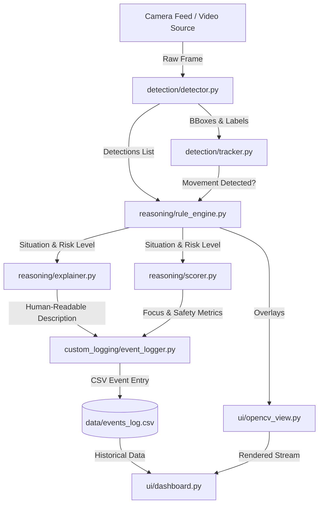

# 🎥 AI Situational Understanding Camera

[](https://www.python.org/)
[](https://opensource.org/licenses/MIT)
[](https://streamlit.io/)
[](https://github.com/ultralytics/ultralytics)

An intelligent is a real-time camera processing pipeline that performs object detection, movement tracking, and situational reasoning. By combining spatial awareness with custom rule-based heuristics, this system calculates real-time focus & safety scores, displays graphical overlays, logs events, and hosts an interactive Streamlit dashboard.This is made using a Gemini-api key. 

---

## 🏗️ System Architecture & Workflow


```mermaid
graph TD
    A[Camera Feed / Video Source] -->|Raw Frame| B[detection/detector.py]
    B -->|BBoxes & Labels| C[detection/tracker.py]
    B -->|Detections List| D[reasoning/rule_engine.py]
    C -->|Movement Detected?| D
    D -->|Situation & Risk Level| E[reasoning/explainer.py]
    D -->|Situation & Risk Level| F[reasoning/scorer.py]
    E -->|Human-Readable Description| G[custom_logging/event_logger.py]
    F -->|Focus & Safety Metrics| G
    D -->|Overlays| H[ui/opencv_view.py]
    G -->|CSV Event Entry| I[(data/events_log.csv)]
    I -->|Historical Data| J[ui/dashboard.py]
    H -->|Rendered Stream| J
```

---

## 📂 Project Structure

```text
situational-camera/
├── main.py                # Main pipeline runner showing execution & call order
├── intergration_test.py   # Integration test script for the pipeline components
├── requirements.txt       # Project dependencies
├── yolov8s.pt             # YOLOv8 Small model weights (locally stored, git-ignored)
├── detection/             # Perception Layer
│   ├── __init__.py
│   ├── detector.py        # YOLOv8 object detector with CLAHE low-light enhancement
│   └── tracker.py         # Multi-person tracking and spatial zone monitoring
├── reasoning/             # Intelligence Proxy Layer
│   ├── __init__.py
│   ├── rule_engine.py     # Situation classification with local rules & optional Gemini verification
│   ├── explainer.py       # Natural language explanation proxy with Gemini Vision or template fallback
│   └── scorer.py          # Real-time safety & focus scoring proxy adjusting for Gemini confidence
├── rules/                 # Intelligence Rules Layer
│   ├── __init__.py
│   ├── rule_engine.py     # Rule-based situation classification rules
│   ├── test_rules.py      # Test script for rules
│   └── test_zone_rules.py # Test script for zone-based classification rules
├── explanation/           # Intelligence Explanation Layer
│   ├── __init__.py
│   └── explanation_generator.py # Natural language explanation templates
├── scoring/               # Intelligence Scoring Layer
│   ├── __init__.py
│   └── scoring.py         # Base safety (0-10) and focus (0-100) scoring rules
├── custom_logging/        # Storage Layer
│   ├── __init__.py
│   └── event_logger.py    # State-change event logger (writes to CSV)
├── ui/                    # Interface Layer
│   ├── __init__.py
│   ├── opencv_view.py     # OpenCV HUD overlays (bounding boxes & telemetry)
│   └── dashboard.py       # SituVision AI live Streamlit dashboard (monitoring, simulator, video upload, login page)
├── data/                  # Data Assets
│   ├── .gitkeep           # git placeholder
│   └── events_log.csv     # Automatically generated event log
└── scratch/               # Development Scratch scripts
    ├── test_detection.py
    ├── test_logger.py
    ├── test_new_rules.py
    ├── test_rendering.py
    └── test_tracker.py
```

---

## 🤝 Shared Data Contracts

Every module has been scaffolded to strict design contracts:

### 1. Object Detection Contract
**Module**: `detection/detector.py` | **Function**: `detect_objects(frame)`
* **Input**: OpenCV image frame (`numpy.ndarray`)
* **Output**: `list` of dictionaries:
  ```python
  [
      {
          "label": "person", 
          "bbox": [x1, y1, x2, y2], 
          "confidence": 0.92,
          "track_id": 1            # Unique tracking ID (integer or None)
      },
      ...
  ]
  ```
* **Enhancement**: Automatically applies CLAHE night-vision enhancement if the average pixel intensity drops below 75.

### 2. Movement & Zone Tracking Contract
**Module**: `detection/tracker.py` | **Functions**:
* `is_moving(person_id, current_bbox) -> bool`
  * **Input**: Unique person ID (`int`/`str`), current bounding box coordinates `[x1, y1, x2, y2]`.
  * **Output**: `bool` indicating if movement exceeds spatial thresholds.
* `track_and_analyze_zones(detections, zones, loitering_threshold=5.0) -> list`
  * **Input**: Current detections, dictionary of zone polygons, and loitering time threshold.
  * **Output**: Detections decorated with `track_id` and `zone_info` (which includes details on trespassing, loitering, perimeter breach, etc.).

### 3. Rule Reasoning & AI Cognition Contract
**Module**: `reasoning/rule_engine.py` (delegates to `rules/rule_engine.py`) | **Function**: `evaluate_situation(detections, movement_detected, frame=None, confidence_threshold=0.6) -> dict`
* **Input**: List of current frame object detections, movement tracking boolean, optional raw image frame for Gemini verification, and confidence threshold.
* **Output**: Evaluation outcome containing Gemini verification details:
  ```python
  {
      "situation": "Distracted Walking",
      "risk": "High",
      "confidence": 0.9,
      "gemini_verified": False  # True if verified/overridden via Google Gemini 1.5 Flash
  }
  ```

### 4. Natural Explanation Contract
**Module**: `reasoning/explainer.py` (delegates to `explanation/explanation_generator.py`) | **Function**: `generate_explanation(frame, detections, situation, risk) -> str`
* **Input**: Raw frame, current detections list, situation string, risk level string.
* **Output**: Human-readable situation context generated by **Gemini Vision** or structured template fallback (e.g., `"Person is walking while using a phone."`).

### 5. Metric Scoring Contract
**Module**: `reasoning/scorer.py` (delegates to `scoring/scoring.py`) | **Function**: `compute_scores(situation, risk, detections=None, gemini_confidence=None) -> dict`
* **Input**: Situation string, risk level string, optional detections list, optional Gemini confidence.
* **Output**: Dynamic safety and focus metrics (scores are adjusted downwards if Gemini returns a low confidence):
  ```python
  {
      "situation": "Distracted Walking",
      "risk": "High",
      "focus_score": 40,      # 0 to 100 range
      "safety_score": 3,      # 0 to 10 range
      "gemini_confidence": 0.9 # float or None
  }
  ```

### 6. Event Logging Contract
**Module**: `custom_logging/event_logger.py` | **Function**: `log_event(event: dict)`
* Appends event data schemas containing `timestamp`, `situation`, `risk`, `explanation`, `focus_score`, `safety_score`, `gemini_confidence`, and `gemini_verified` to `data/events_log.csv`.

---

## ⚡ Quick Start

### ⚙️ Prerequisites
* **Python 3.8+**
* **Node.js 16+** & **npm**
* A valid `.env` file inside the `situational-camera/` directory with `GOOGLE_API_KEY` to enable the Gemini cognitive pipeline:
  ```env
  GOOGLE_API_KEY=your_gemini_api_key_here
  ```

### 1. Installation & Environment Setup
Clone the repository and install the backend and frontend dependencies:
```bash
# Clone the repository
git clone https://github.com/Chathuka-Pehesara/AI-Situational-Understanding-Camera.git
cd AI-Situational-Understanding-Camera/situational-camera

# Create a virtual environment
python -m venv venv

# Activate it (Windows)
.\venv\Scripts\activate

# Install python dependencies
pip install -r requirements.txt

# Install frontend dependencies
cd web
npm install
cd ..
```

### 2. Running the Backend API
Start the FastAPI server from the `situational-camera/` directory:
```bash
uvicorn api.main:app --port 8000 --reload
```
* **Swagger Documentation**: Accessible at [http://127.0.0.1:8000/docs](http://127.0.0.1:8000/docs).
* **Endpoints**: Includes WebSocket stream, active alerts, and CSV event loaders.

### 3. Running the React Frontend (SituVision AI)
Start the Vite development server:
```bash
cd web
npm run dev
```
* Access the web interface at [http://localhost:5173](http://localhost:5173).
* **Credentials**: Sign in using any dummy email (default: `operator@situvision.ai`) and password.

---

## 📜 License
Distributed under the MIT License. See [LICENSE](LICENSE) for details.
