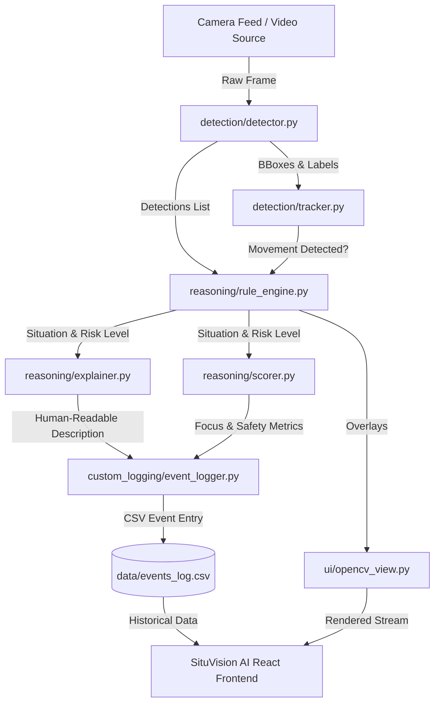

# 🎥 AI Situational Understanding Camera (SituVision AI)

  
<strong>An intelligent real-time camera processing pipeline for object detection, movement tracking, and situational reasoning.</strong>

  

    
    
    
    
    
  

 

AI Situational Understanding Camera (SituVision AI) is an intelligent real-time camera processing system that performs object detection, movement tracking, and situational reasoning. By combining **YOLOv8**, **custom rule-based heuristics**, and **Google Gemini** for advanced scene understanding, the system identifies activities, evaluates risk levels, generates natural-language explanations, computes real-time focus and safety scores, and visualizes insights through a modern React dashboard. The platform also supports structured event logging for auditing and historical analysis.

---

## ✨ Key Features

- 🎯 **Real-Time Object Detection** – Powered by **YOLOv8** for fast and accurate object detection with automatic CLAHE enhancement for improved low-light performance.
- 🚶 **Multi-Object Tracking** – Tracks people across frames and monitors spatial behaviors such as loitering, trespassing, and movement patterns.
- 🧠 **Rule-Based Reasoning with AI Verification** – Uses custom heuristics to classify situations and optionally verifies complex scenes using **Google Gemini**.
- 💬 **Natural Language Explanations** – Converts visual observations into human-readable explanations describing detected situations and associated risks.
- 📊 **Dynamic Safety & Focus Scoring** – Continuously computes Safety (0–10) and Focus (0–100) scores based on detected activities and environmental context.
- 🌐 **Modern Web Dashboard** – Interactive React + Vite interface for live monitoring, alerts, analytics, and historical event visualization.
- 📝 **Structured Event Logging** – Stores detected events, scores, explanations, timestamps, and AI verification results in CSV format.
- ⚡ **FastAPI Backend** – Provides REST APIs and WebSocket endpoints for real-time communication between the detection pipeline and frontend.
- 🔒 **Modular Architecture** – Clean separation of perception, reasoning, explanation, scoring, logging, and visualization modules for easy scalability and maintenance.

---

## 🏗️ System Architecture & Workflow

```mermaid
graph TD
    A[Camera Feed / Video Source] -->|Raw Frame| B[detection/detector.py]
    B -->|BBoxes & Labels| C[detection/tracker.py]
    B -->|Detections List| D[reasoning/rule_engine.py]
    C -->|Movement Detected?| D
    D -->|Situation & Risk Level| E[reasoning/explainer.py]
    D -->|Situation & Risk Level| F[reasoning/scorer.py]
    E -->|Human-Readable Description| G[custom_logging/event_logger.py]
    F -->|Focus & Safety Metrics| G
    D -->|Overlays| H[ui/opencv_view.py]
    G -->|CSV Event Entry| I[(data/events_log.csv)]
    I -->|Historical Data| J[SituVision AI React Frontend]
    H -->|Rendered Stream| J
```